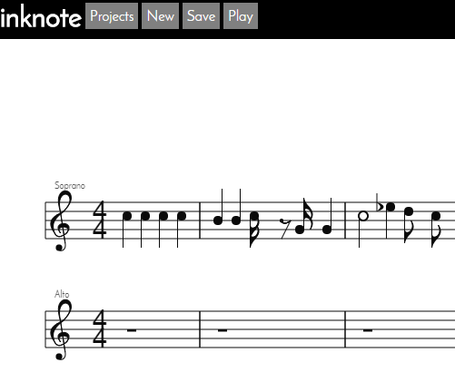
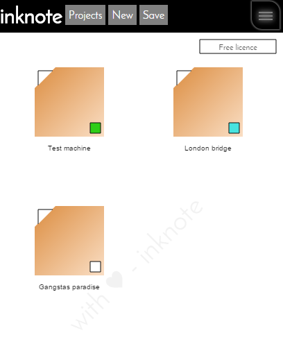

inknote
=======

Compose music easily in your browser!

http://www.michalpaszkiewicz.co.uk/inknote/

Store multiple files, tag them with colours.

Uses AngularJS, Html5 Canvas, PeerJS

If you would like to contribute, please go ahead and fork, push, pull, etc!

Please also visit the developer's forum:

http://www.michalpaszkiewicz.co.uk/inknote/developer/

Upcoming updates
------------------
- Score chords.
- Change instance time/key signatures.
- Other musical symbols - ties, dynamics, staccato, etc.
- Keyboard setup options.
- Add collaboration option.
- Guitar Tab/chord name display modes.
- Alternative display modes - e.g. keyboard blocks, phrase blocks.
- About/faq information.
- Composer forums.
- Enable push notifications in forums.
- AUDIO samples
- Copy, cut and paste.
- Undo & Redo.
- Sharps and flats.
- Cloud storage for open source projects.
- Music dif tool.
- Scoring intellisense.

Update 29/09/2015
------------------
- Complete revamp of project.
- Audio/playback added.
- Mobile friendly.
- File download/upload
- Copy, cut and paste on bars.
- Undo and redo on copy, cut and paste.
